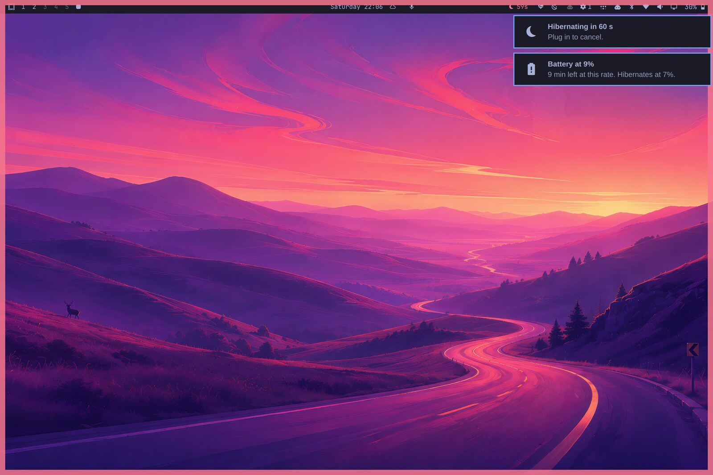
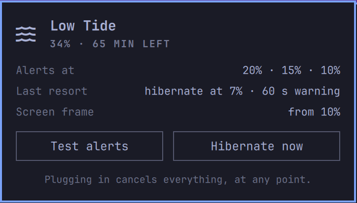

# Low Tide

Low-battery alerts that get louder, a pulsing frame around your screen that you cannot miss, and an automatic
hibernate before the battery gives out.



Omarchy warns you once, at 10%, with a toast that lasts thirty seconds. If you are heads-down, in a fullscreen app, or
the battery is a few years old and falls off a cliff at 3%, that is how a session gets lost. Low Tide is built for that
laptop.

It also works on hardware where that built-in warning never fires at all: some laptops report "not on battery" to UPower
while unplugged and draining. Low Tide reads the battery's own state instead.

## What it does

- **Staged alerts** at 20%, 15% and 10% (yours to change). The first is an ordinary toast. The second breaks through
  Do Not Disturb. The last stays on screen until you dismiss it. Each says how long you have left at the current drain.
- **A screen frame.** From the last alert level down, a frame in your theme's urgent color pulses around every screen.
  It is click-through and takes no keyboard focus, so it never gets in the way of saving your work, and it shows over
  fullscreen apps. It vanishes the moment you plug in.
- **A last resort.** At 7% it starts a 60-second countdown — "Hibernating in 60 s. Plug in to cancel." — and then
  hibernates, so your session is on disk instead of lost. If hibernate fails, it falls back to a clean shutdown.
  Plugging in cancels at any point.
- **A bar widget**: a small dimmed wave while the battery is fine (Omarchy's power widget already shows the charge, so
  this isn't a second battery icon), turning into the charge and minutes left in the urgent color, or the countdown,
  when it is low. Click it for status, battery health, **Hibernate now**, and **Test alerts**.

It will not hibernate in a loop: after resuming on battery, it waits until the charge has fallen a further 2%.



## Before you rely on it

**Test hibernate once by hand**, plugged in, with nothing unsaved: Omarchy menu → System → Hibernate, then power on and
check that your session comes back. Hibernation needs swap and a `resume=` kernel parameter (`omarchy hibernation setup`
does both; `omarchy-hibernation-available` tells you if it is ready). If resume does not work on your hardware, set
`"action": "poweroff"` instead.

Pick levels that fit your battery. A worn battery can die while still reporting a few percent, so its safety net has to
sit above that.

## Install

```bash
omarchy plugin add https://github.com/cgranier/omarchy-low-tide.git --enable
```

Requires UPower (standard on Omarchy). To avoid two toasts at 10%, you can switch off Omarchy's own single warning with
`omarchy plugin disable omarchy.battery`.

## Settings

Inline on the plugin's entry in `~/.config/omarchy/shell.json`; they apply the moment you save.

```bash
jq '(.bar.layout.right[] | select(.id=="cgranier.lowtide")) += {"levels": [25, 15, 10], "actionAt": 8}' \
  ~/.config/omarchy/shell.json > /tmp/shell.json && cat /tmp/shell.json > ~/.config/omarchy/shell.json
```

| Key | Default | Meaning |
|---|---|---|
| `levels` | `[20, 15, 10]` | Alert percentages. The lowest is also where the screen frame starts. |
| `action` | `hibernate` | Last resort: `hibernate`, `poweroff`, or `none` (alerts only). |
| `actionAt` | `7` | Percentage at which the countdown starts. Always kept below the lowest alert level. |
| `countdownSec` | `60` | Warning time before the action (10–600). |
| `frame` | `true` | The pulsing screen frame. |
| `notify` | `true` | The staged toasts. The countdown toast always shows. |
| `hideWhenFine` | `false` | Hide the bar icon entirely until the battery is low. |

## Try it without draining your battery

Simulation feeds the plugin fake readings. **While simulating, nothing real is ever done** — the last resort only says
what it would have done.

```bash
omarchy-shell cgranier.lowtide simulate 19 discharging   # first alert
omarchy-shell cgranier.lowtide simulate 9 discharging    # last alert + screen frame
omarchy-shell cgranier.lowtide simulate 7 discharging    # countdown
omarchy-shell cgranier.lowtide simulate 7 charging       # "plugged in": cancels
omarchy-shell cgranier.lowtide stopSimulation
omarchy-shell cgranier.lowtide state                     # JSON: reading, stage, countdown, config
```

The panel's **Test alerts** button runs a 12-second simulation at 9%.

## Uninstall

```bash
omarchy plugin remove cgranier.lowtide
```

Low Tide writes nothing to disk. If you disabled `omarchy.battery`, re-enable it with `omarchy plugin enable omarchy.battery`.

## Development

```
manifest.json   service + bar-widget declaration
Service.qml     battery watching, toasts, simulation, last-resort action, the screen frame
Panel.qml       bar widget + panel
Model.js        pure logic: stages, the alert/countdown/act state machine, texts
tests/          node tests
```

`node tests/model.test.js` · `omarchy plugin validate .`

## License

MIT
